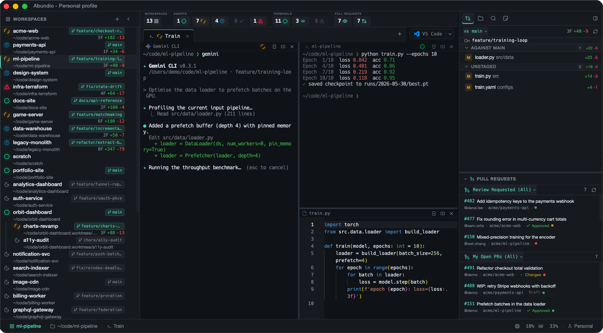

# Abundio

A GPU-accelerated terminal multiplexer desktop app built with [Tauri v2](https://v2.tauri.app). Abundio is a home base for project-centric, AI-assisted development — a place to run your shells, your editor, your git workflow, and your AI coding agents side by side, all scoped to the project you're working on.



*The name comes from the Latin _abundō_ ("to overflow, abound") — Abundio is built for an **abundance of productivity**, giving you room to run an abundance of terminals, agents, and parallel work without leaving your project.*

Each **workspace** is bound to a project folder. Inside it you get a fast WebGL-rendered terminal that you can split into as many horizontal and vertical panes as you like and organize across multiple tabs — run a dev server in one pane, tail logs in another, and drive an AI agent in a third. Abundio has **first-class support for AI coding CLI agents** (Claude Code, GitHub Copilot CLI, Gemini CLI, Aider, Codex, and OpenCode): it auto-detects the ones installed on your `$PATH`, lets you define your own, and surfaces live activity status so you can see at a glance which agents are working.

Around the terminal sits a full development surface: a **file explorer** and Monaco-powered **code editor** for viewing and editing files, **git integration** with a changed-files panel and inline diffs, a **GitHub PR panel**, **full-text workspace search**, live **Markdown preview**, and a **notes** panel — plus the ability to hand the current workspace off to VS Code, Cursor, or a JetBrains IDE when you want a heavier editor. Terminal output is clickable (file paths printed by compilers, test runners, and agents open straight in the editor), scrollback is persisted across sessions, and an overview bar keeps a running count of your workspaces, agents, terminals, and open PRs. Abundio runs natively on macOS, Windows, and Linux.


## Install

Download a pre-built binary for your platform from the [**latest release**](https://github.com/emullernl/abundio/releases/latest):

* **macOS** — grab the `.dmg`, open it, and drag Abundio into your Applications folder.
* **Windows** — run the `.msi` installer (or the `.exe` from the NSIS bundle).
* **Linux** — install the `.deb` (`sudo dpkg -i abundio_*.deb`) or run the `.AppImage` directly (`chmod +x` first).

See [all releases](https://github.com/emullernl/abundio/releases) for previous versions and changelogs. Prefer to build from source? See [Getting Started](#getting-started) below.

> **Note:** Abundio is not yet code-signed. On macOS, right-click the app and choose **Open** the first time to bypass Gatekeeper; on Windows, click **More info → Run anyway** if SmartScreen warns you.

## Features

* **GPU-accelerated rendering** — WebGL-powered terminal via xterm.js with canvas fallback
* **Split panes** — Horizontal and vertical splits with recursive nesting
* **Tabs** — Multiple tabs per workspace, each with its own pane layout
* **Workspace management** — Persistent workspaces tied to project directories, stored in SQLite
* **AI agent support** — Auto-detects installed agents (Claude Code, Copilot, Gemini, Aider, Codex, OpenCode) on your `$PATH`, supports user-defined custom agents, and shows live activity status as agents work
* **Overview bar** — At-a-glance counts of workspaces, agents, terminals, and open PRs
* **Built-in code editor** — Monaco-powered editor for viewing and editing files
* **Live Markdown preview** — Side-by-side preview pane with Mermaid diagram rendering
* **File explorer** — Tree view with Nerd Font icons, image preview, and file operations
* **Notes** — Per-workspace notes editor in the side panel
* **Clickable file links in terminal** — Open file paths printed by tools (compilers, test runners, agents) directly in the editor
* **Git integration** — Changed files panel, branch selector, inline diff viewer
* **GitHub PR panel** — Review requests and your PRs via GitHub CLI
* **Workspace search** — Full-text search across project files with cancellation
* **External editor integration** — Detects and launches VS Code, Cursor, JetBrains IDEs, and others for the current workspace
* **Theming** — Multiple built-in themes (dark and light) with live switching
* **Scrollback persistence** — Terminal scrollback is saved and restored across sessions
* **Native macOS integration** — Overlay titlebar with traffic light controls
* **Cross-platform** — macOS, Windows, and Linux support
* **Command palette** — Quick access to actions via `Cmd+K` / `Ctrl+K`

## Keyboard Shortcuts

Shortcuts use `Cmd` on macOS, `Ctrl` on Windows/Linux.

| Action                  | macOS             | Windows/Linux      |
| ----------------------- | ----------------- | :----------------- |
| Split horizontal        | `Cmd+Shift+H`     | `Ctrl+Shift+H`     |
| Split vertical          | `Cmd+Shift+V`     | `Ctrl+Shift+V`     |
| Close pane              | `Cmd+Shift+W`     | `Ctrl+Shift+W`     |
| Navigate panes          | `Cmd+Shift+Arrow` | `Ctrl+Shift+Arrow` |
| Command palette         | `Cmd+K`           | `Ctrl+K`           |
| File quickopen          | `Cmd+P`           | `Ctrl+P`           |
| Find in terminal        | `Cmd+F`           | `Ctrl+F`           |
| Search workspace        | `Cmd+Shift+F`     | `Ctrl+Shift+F`     |
| Toggle git panel        | `Cmd+Shift+G`     | `Ctrl+Shift+G`     |
| Toggle explorer panel   | `Cmd+Shift+E`     | `Ctrl+Shift+E`     |
| Toggle notes panel      | `Cmd+Shift+K`     | `Ctrl+Shift+K`     |
| Toggle markdown preview | `Cmd+Shift+M`     | `Ctrl+Shift+M`     |
| New workspace           | `Cmd+Shift+N`     | `Ctrl+Shift+N`     |
| New tab                 | `Cmd+T`           | `Ctrl+T`           |
| Close tab               | `Cmd+W`           | `Ctrl+W`           |
| Next tab                | `Cmd+Shift+]`     | `Ctrl+Shift+]`     |
| Previous tab            | `Cmd+Shift+[`     | `Ctrl+Shift+[`     |
| Increase font size      | `Cmd+=`           | `Ctrl+=`           |
| Decrease font size      | `Cmd+-`           | `Ctrl+-`           |
| Save file               | `Cmd+S`           | `Ctrl+S`           |
| Open settings           | `Cmd+,`           | `Ctrl+,`           |

## Runtime requirements

Abundio shells out to a few external command-line tools at runtime. Only a shell is strictly required — the rest light up individual features and the app runs fine without them (those panels simply stay empty).

* **A login shell** (required) — the terminal spawns your `$SHELL` (defaults to `/bin/zsh`). This is the only hard requirement.
* **[`gh`](https://cli.github.com/) (GitHub CLI)** (optional) — powers the GitHub PR panel (review requests and your open PRs). Must be authenticated (`gh auth login`).

> **Note:** Abundio does **not** require the `git` CLI. All git functionality — the changes panel, branch selector, inline diffs, sidebar git chips, and GitHub-remote detection — runs in-process via a bundled libgit2.
* **AI coding agent CLIs** (optional) — any of [Claude Code](https://docs.claude.com/en/docs/claude-code), [GitHub Copilot CLI](https://github.com/github/gh-copilot), [Gemini CLI](https://github.com/google-gemini/gemini-cli), [Aider](https://aider.chat/), [Codex](https://github.com/openai/codex), or [OpenCode](https://opencode.ai/). Abundio auto-detects whichever are on your `$PATH`; you can also define custom agents in Settings.

## Prerequisites

These are the tools needed to **build and run Abundio from source** (in addition to the runtime requirements above):

* **Node.js** >\= 20.19 (required by Vite 8)
* **pnpm** — `npm install -g pnpm`
* **Rust** — Install via [rustup](https://rustup.rs/)
* **Tauri v2 system dependencies** — See [Tauri prerequisites](https://v2.tauri.app/start/prerequisites/) for your platform (Xcode Command Line Tools on macOS, `webkit2gtk` + `libappindicator` on Linux)

## Getting Started

```bash
# Clone the repo
git clone <repo-url> && cd abundio

# Install frontend dependencies
pnpm install

# Run in development mode (starts Vite dev server + Tauri app)
pnpm tauri dev
```

The app's SQLite database is created automatically at `~/Library/Application Support/abundio/abundio.db` on first launch.

## Building

To build a production binary:

```bash
pnpm tauri build
```

This compiles the Rust backend in release mode and bundles the frontend into a native application. Build artifacts are output to `src-tauri/target/release/bundle/`:

* **macOS**: `.dmg` and `.app` in `bundle/dmg/` and `bundle/macos/`
* **Windows**: `.msi` installer in `bundle/msi/` and `.exe` in `bundle/nsis/`
* **Linux**: `.deb` in `bundle/deb/` and `.AppImage` in `bundle/appimage/`

The first build takes several minutes while Cargo compiles all Rust dependencies in release mode. Subsequent builds are incremental.

## Development

### Commands

```bash
pnpm tauri dev              # Run dev server (Vite + Tauri)
pnpm tauri build            # Build production binary
pnpm build                  # TypeScript check + Vite build
pnpm test                   # Run all Vitest tests
pnpm test -- path/to/file   # Run a single test file
pnpm check                  # Biome lint/format check
pnpm check:fix              # Biome auto-fix
```

```bash
cd src-tauri && cargo check           # Rust type check
cd src-tauri && cargo test            # Run all Rust tests
cd src-tauri && cargo test test_name  # Run a single Rust test
```

### Demo mode

Demo mode runs the app against in-memory mock fixtures instead of touching real
PTYs, git, GitHub, or the filesystem — useful for screenshots, screen
recordings, or contributor onboarding. It serves a curated set of workspaces,
agents, transcripts, and git state so the UI looks "alive" without any setup.

```bash
pnpm demo       # Tauri app with mock fixtures
pnpm demo:web   # Browser-only (Vite, no Tauri backend)
```

Both set `VITE_ABUNDIO_DEMO=true`. The mock layer lives in `src/lib/demo/`
(`mockInvoke`, `mockListen`, and the `fixtures`/`transcripts` it serves).

### Project Structure

```
abundio/
├── src/                # Frontend — React 19 + TypeScript
│   ├── components/     # UI: Terminal, Sidebar, Explorer, FileViewer, GitChanges, Search, OverviewBar, …
│   ├── hooks/          # React hooks (split pane, PTY lifecycle, workspace, drag-and-drop)
│   ├── lib/            # IPC, themes, terminal manager, keybindings, agent registry, file links
│   └── stores/         # Zustand stores (workspace, settings, git, search, explorer, agents, PRs)
├── src-tauri/          # Backend — Rust + Tauri v2
│   └── src/            # PTY manager, workspace store, agent registry + hooks, git/GitHub/search/file commands, dev-env detection
├── docs/               # Architecture decision records (ADRs) and design plans
├── scripts/            # Release helper (`pnpm run release`)
├── .github/workflows/  # CI: build, test, PR review, security scan
├── CLAUDE.md           # Reference for AI coding agents working in the repo
├── CONTEXT.md          # Canonical domain-language definitions
├── package.json
└── biome.json
```

For a full module-by-module map, see [`CLAUDE.md`](CLAUDE.md).

### Tech Stack

| Layer     | Technology                                                        |
| --------- | ----------------------------------------------------------------- |
| Framework | Tauri v2                                                          |
| Backend   | Rust — portable-pty, rusqlite, crossbeam-channel, dashmap, notify, ignore |
| Frontend  | React 19, TypeScript 6, Vite 8                                    |
| Terminal  | xterm.js 6.x with WebGL addon                                     |
| Editor    | Monaco Editor                                                     |
| State     | Zustand 5                                                         |
| Styling   | Tailwind CSS v4, Framer Motion                                    |
| Linting   | Biome (tab indentation)                                           |
| Package   | pnpm                                                              |

### Architecture Overview

**Data flow:**

```
Terminal input → pty.write() IPC → crossbeam channel → OS thread → PTY stdin
PTY stdout → OS thread reads → base64 encode → Tauri event → xterm.write()
```

PTY management runs on dedicated OS threads (not async) using crossbeam channels. PTY output is base64-encoded before crossing the IPC boundary. The frontend receives events and writes raw bytes to xterm.js.

**Pane layout** is a recursive tree stored as JSON in SQLite:

```
PaneNode = Terminal { id, ptyId }
         | Split { id, direction, ratio, first: PaneNode, second: PaneNode }
```

Each workspace supports multiple tabs, with each tab maintaining its own pane layout tree.

### Key Conventions

* Rust errors use the `AbundioError` enum (thiserror + Serialize) — never `Result<T, String>`
* PTY data is binary: base64 over IPC, `Uint8Array` in the frontend — never treat as UTF-8 strings
* Resize events are debounced (100ms); layout persists to DB only on mouseup
* Empty `ptyId` in a layout node means "spawn PTY on first render"
* Shell is spawned with `-l -i` flags (login + interactive) with `TERM_PROGRAM=Abundio`
* Keybindings use capture phase to intercept before xterm.js
* Cross-platform keybindings: `Cmd` on macOS, `Ctrl` on Windows/Linux
* Biome enforces tab indentation — run `pnpm check:fix` before committing

## Onboarding Guide for New Developers

### 1. Environment Setup

```bash
# Install Rust
curl --proto '=https' --tlsv1.2 -sSf https://sh.rustup.rs | sh

# Install pnpm (if you don't have it)
npm install -g pnpm

# Install Xcode Command Line Tools (macOS)
xcode-select --install
```

### 2. Clone and Run

```bash
git clone <repo-url> && cd abundio
pnpm install
pnpm tauri dev
```

The first build will take a few minutes while Cargo compiles all Rust dependencies. Subsequent builds are incremental and much faster.

### 3. Where to Start Reading

1. **`CONTEXT.md`** — Canonical domain language (Workspace, Pane, PTY, Tab, Agent, …). Read this first so terms aren't ambiguous later.
2. **`CLAUDE.md`** — Full architecture reference and module map.
3. **`src-tauri/src/lib.rs`** — App bootstrap: DB init, PTY manager, agent registry, file watcher.
4. **`src-tauri/src/commands.rs`** — All IPC commands the frontend can call.
5. **`src/lib/ipc.ts`** — Frontend-side typed wrappers for those commands.
6. **`src/components/Terminal/TerminalInstance.tsx`** — The core terminal component.
7. **`src/stores/workspaceStore.ts`** — Central state for workspaces, tabs, and pane layout.

### 4. Common Tasks

**Adding a new Tauri command:**

1. Add the handler in `src-tauri/src/commands.rs` returning `Result<T, AbundioError>`
2. Register it in the `.invoke_handler()` call in `src-tauri/src/lib.rs`
3. Add a typed wrapper in `src/lib/ipc.ts`

**Adding a new theme:**

1. Define the theme object in `src/lib/themes.ts`
2. It will automatically appear in the settings UI

**Adding a DB migration:**

1. Add a new SQL statement to `src-tauri/src/migrations.rs`
2. Migrations auto-apply on app startup

### 5. Development Tips

* Use `pnpm check` before pushing to catch lint/format issues early
* The Tauri dev server supports hot reload for frontend changes; Rust changes require a recompile
* The SQLite database can be inspected directly at `~/Library/Application Support/abundio/abundio.db`
* If Cargo isn't on your PATH, it's at `~/.rustup/toolchains/stable-x86_64-apple-darwin/bin/cargo`

## Releasing

Releases are triggered by git tags. A helper script bumps the version in all config files, commits, and tags:

```bash
pnpm run release 0.2.0        # bumps version, commits, creates v0.2.0 tag
git push --follow-tags         # triggers CI build for all platforms
```

This creates a draft [GitHub Release](../../releases) with macOS, Linux, and Windows artifacts. Review the draft on GitHub and publish when ready.

## License

Abundio is dual-licensed under either of:

- [MIT License](LICENSE-MIT)
- [Apache License, Version 2.0](LICENSE-APACHE)

at your option. See [LICENSE.md](LICENSE.md) for details.

Unless you explicitly state otherwise, any contribution intentionally submitted for inclusion in Abundio shall be dual-licensed as above, without any additional terms or conditions.